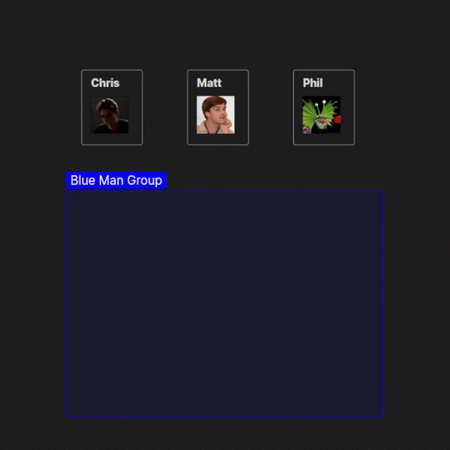

# Canvas Groups Update Node Color Plugin for ObsidianMD

It bothered me that I had to manually set every node that I grouped to the group's color- so I made this plugin that automatically sets a grouped node to the color of its group.

## Installation

1. Open **Options** >> **Community plugins** & click **"Turn on community plugins"**, leave this tab open
2. Download `main.js` & `manifest.json` from the [latest release](https://github.com/neonpalms/obsidian-canvas-groups-update-color/releases/latest)
3. Make a subdirectory in your vault's `.obsidian/plugins/` directory (name whatever you want, e.g. `obsidian-canvas-groups-update-color`)
    - If you don't have a `plugins/` directory, you can make that too
4. Move `main.js` & `manifest.json` into the directory you just made
5. Back to Obsidian, refresh the **Installed plugins** pane & activate the new plugin

This plugin was built for ObsidianMD version `1.6.7` but should work with all versions that support the Canvas core plugin.

## Feedback & Contributions

Feel free to open an issue or submit a pull request on GitHub if you'd like to suggest features or report bugs!
